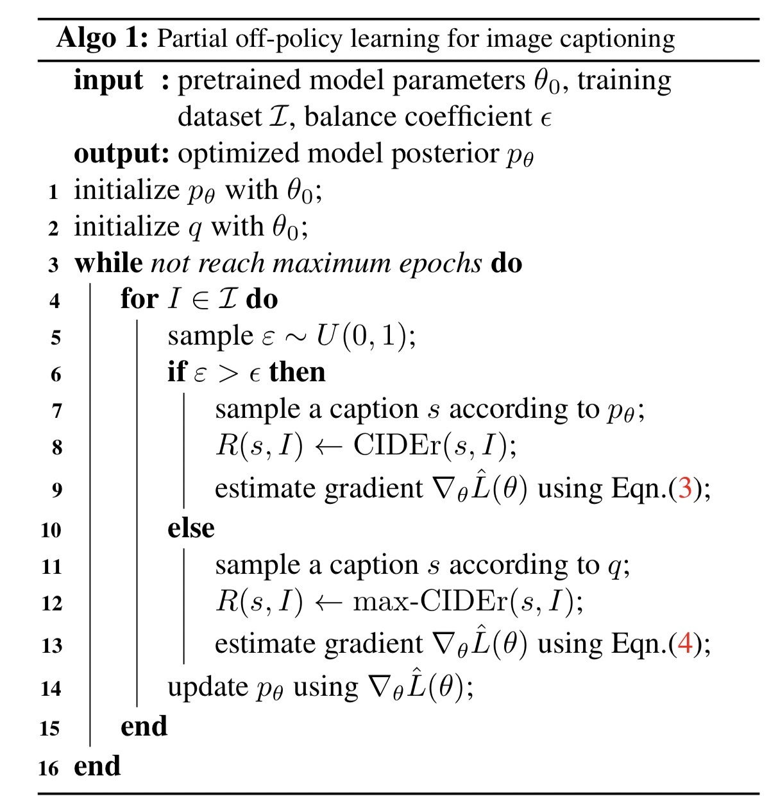

- ## Literature Review
	- ### Partial Off-policy Learning: Balance Accuracy and Diversity for Human-Oriented Image Captioning
		- PDF: 
		- ### Take Aways
			- use q for exploration
		- #### Key Ideas
			- Introduce a new method for image captioning called Partial Off-policy Learning (POL) that balance the accuracy and diversity of the generated captions.
			- Propose a new model that uses off-policy learning to improve the diversity of the generated captions, while still maintaining their accuracy.
			- The model uses a reward function that is designed to encourage the model to generate diverse captions that are also consistent with the image and human-generated captions.
			- Show that the proposed POL model outperforms existing methods on the MS-COCO dataset in terms of both automatic evaluation metrics and human evaluation.
			- The proposed model is able to generate more diverse and accurate captions by making use of off-policy learning, which allows the model to explore a wider range of possible captions, while still maintaining their accuracy.
			- max-CIDEr
			- The model is able to balance the trade-off between accuracy and diversity, which is important for human-oriented image captioning.
			- 
	- ### Image Captioning with multi-level similarity-guided semantic matching
		- PDF: 
		- #### Key Ideas
			- Using a multi-level similarity-guided semantic matching approach that captures both global and local semantic similarities between the image and caption to generate more accurate and informative captions.
			- Proposing a new multi-level similarity-guided semantic matching module that integrates different levels of visual and semantic information to guide the caption generation process.
			- Showing the effectiveness of the proposed approach through experiments on the MS-COCO dataset and comparing the performance with the state-of-the-art models, achieving better results in both automatic evaluation metrics and human evaluation.
			- ((63c2d402-559f-4b65-8f44-ab4675b7e73d))
	- ### Vocabulary-Wide Credit Assignment for Training Image Captioning Models
		- PDF: 
		- #### Key Ideas
			- Introduce a new training method for image captioning models that assigns credit for each word in the vocabulary, rather than just for the final caption generated.
			- Propose a new vocabulary-wide credit assignment (VWCA) method that uses a reinforced sampling mechanism to assign credit to each word in the vocabulary.
			- Reduce the time cost of metrics calculation in VCST, we propose fast algorithms for computing the CIDEr-D metric and the BLEU metric. With our fast computing methods, the time costs for computing CIDEr-D and BLEU-4 are reduced by 97% and 72%, respectively.
			- Show that the VWCA method improves the performance of image captioning models on the MS-COCO dataset, compared to the traditional methods of credit assignment.
			- Show that the VWCA method is able to generate more diverse captions, and also able to learn from more diverse captions in the training data, which helps the model to learn a more comprehensive representation of the captions.
			- ((63c2d50f-546e-4992-b02d-2c06411cf1ff))
	- ### TCIC: Theme Concepts Learning Cross Language and Vision for Image Captioning
		- PDF: 
		- #### Key Ideas
			- Introduce a new image captioning method that learns to associate theme concepts from a visual scene with the corresponding textual descriptions.
			- Propose a new method called TCIC (Theme Concepts Learning for Image Captioning) which consists of two main parts: theme concepts learning and cross-modal attention mechanism.
			- Theme Concepts Learning: where the model learns to extract theme concepts from the visual scene and textual descriptions.
			- Cross-modal Attention Mechanism: where the model aligns the theme concepts learned from the visual and textual modalities, allowing the model to generate more accurate and informative captions.
			- Show that the TCIC approach outperforms existing image captioning methods on the MS-COCO dataset in terms of both automatic evaluation metrics and human evaluation.
			- Show that the TCIC method is able to learn more comprehensive representations of the captions by learning theme concepts that go beyond object recognition and to generate more diverse captions.
			- ((63c2d570-579a-41a4-8b37-b4b43f2db791))
	- ### Automatic Report Generation for Chest X-Ray Images via Adversarial Reinforcement Learning
		- PDF: 
		- #### Key Ideas
			- Introduce a new method for generating diagnostic reports for chest X-ray images using adversarial reinforcement learning (RL).
			- Propose a new RL-based model that consists of two main components: a generator and a discriminator.
			- The generator is responsible for generating diagnostic reports, while the discriminator is responsible for evaluating the quality of the generated reports.
			- The generator and discriminator are trained using adversarial RL, where the generator tries to generate reports that can fool the discriminator, while the discriminator tries to correctly identify the generated reports as real or fake.
			- Show that the proposed RL-based model outperforms existing methods in terms of both automatic evaluation metrics and human evaluation on the ChestX-ray14 dataset.
			- The model is able to generate more accurate and informative diagnostic reports, and it can be applied to other medical imaging modalities as well.
			- ((63c2d6dd-dcb2-4c11-a96a-95ce5c4b02ae))
			- ((63c2d729-7fbe-4934-bd3a-b8f5409effff))
	- ### Fast Sequence Generation with Multi-Agent Reinforcement Learning
		- PDF: 
		- #### Key Ideas
			- Introduce a new method for fast sequence generation using multi-agent reinforcement learning (RL).
			- Propose a new multi-agent RL-based model that consists of multiple agents, each responsible for generating a single token in the sequence.
			- Each agent is trained to generate a token that maximizes the expected reward, which is a function of the overall quality of the generated sequence.
			- Show that the proposed multi-agent RL-based model is able to generate sequences much faster than traditional RL-based models, as well as achieving comparable or better quality of the generated sequences.
			- Show that the proposed model outperforms existing methods on several benchmark datasets for natural language processing tasks such as language modeling, machine translation, and summarization.
			- The proposed model is also able to handle very long sequences and generate them much faster than traditional methods.
	- ### Multi-Level Policy and Reward Reinforcement Learning for Image Captioning
		- PDF: 
		- #### Key Ideas
			- Introduce a new method for image captioning using multi-level policy and reward reinforcement learning (RL).
			- Propose a new RL-based model that uses a multi-level policy and reward structure to guide the caption generation process.
			- The model consists of three levels: a global-level policy, a local-level policy, and a reward function.
			- The global-level policy is responsible for generating a high-level plan for the caption, while the local-level policy is responsible for generating detailed descriptions of the image.
			- The reward function is used to evaluate the quality of the generated captions, and is used to guide the learning of the policies.
			- Show that the proposed multi-level RL-based model outperforms existing methods on the MS-COCO dataset in terms of both automatic evaluation metrics and human evaluation.
			- The proposed model is able to generate more accurate and informative captions by making use of the multi-level policy and reward structure, which allows for a more fine-grained control of the caption generation process.
	- ### Remote sensing image captioning via Variational Autoencoder and Reinforcement Learning  - **
		- PDF: 
		- #### Key Ideas
			- Introduce a new method for remote sensing image captioning that combines the use of Variational Autoencoder (VAE) and Reinforcement Learning (RL).
			- Propose a new model that uses a VAE to encode the remote sensing image into a latent space and an RL-based decoder to generate captions for the image.
			- The model is trained using a combination of VAE and RL to generate captions that are consistent with the image, while also being diverse and informative.
			- Show that the proposed model outperforms existing methods on a remote sensing image captioning dataset in terms of automatic evaluation metrics and human evaluation.
			- The proposed model is able to generate more accurate and informative captions by making use of VAE to extract features from the images and RL to guide the caption generation process.
			- The model is able to handle remote sensing images that have different characteristics than natural images and generate captions that are more relevant to the remote sensing context.
	- ### Human Consensus-Oriented Image Captioning
		- PDF: 
		- #### Key Ideas
			- Introduce a new method for image captioning that focuses on generating captions that align with human consensus.
			- Propose a new model that uses a human consensus-oriented approach to guide the caption generation process, by taking into account the human-generated captions of the same image available in the datasets.
			- The model is trained to generate captions that have a high agreement with the captions generated by human evaluators.
			- The model uses a novel consensus-oriented loss function, which is designed to encourage the model to generate captions that are similar to the human-generated captions.
			- Show that the proposed model outperforms existing methods on the MS-COCO and Flickr30k datasets in terms of both automatic evaluation metrics and human evaluation.
			- The proposed model is able to generate captions that are more similar to human-generated captions and aligns with human consensus, which makes the generated captions more accurate, informative, and natural.
	- ### S2 Transformer for Image Captioning - **
		- PDF: 
		- #### Key Ideas
			- Introduce a new method for image captioning that uses the S2 Transformer architecture.
			- Propose a new image captioning model that is based on the S2 Transformer architecture, which is an extension of the Transformer architecture that is designed to handle sequences of variable length.
			- The S2 Transformer-based model is trained to generate captions for images by aligning the image and text representations using self-attention mechanisms.
			- Show that the proposed S2 Transformer-based model outperforms existing methods on the MS-COCO dataset in terms of both automatic evaluation metrics and human evaluation.
			- The proposed model is able to generate more accurate and informative captions by making use of the S2 Transformer architecture, which allows for better handling of variable-length sequences and more fine-grained control of the caption generation process.
	- ### VisualGPT: Data-Efficient Adaptation of Pretrained Language Models for Image Captioning - **
		- PDF: 
		- #### Take aways
			- SRAU module may work well.
		- #### Key Ideas
			- Introduce a new method for adapting pre-trained language models for image captioning tasks with a small amount of data.
			- Propose a new model called VisualGPT that fine-tunes a pre-trained GPT-2 model on image captioning datasets by incorporating visual information through a visual-language embedding.
			- Show that the proposed model, VisualGPT, achieves comparable or better performance than state-of-the-art models on the MS-COCO and Flickr30k datasets while requiring significantly less data and computational resources.
			- The model is able to leverage the pre-trained GPT-2 model's language understanding capabilities to generate more accurate and informative captions and the visual-language embedding allows it to incorporate visual information for better performance.
			- The proposed model is able to adapt to new image captioning tasks with a small amount of data, which makes it data-efficient and more practical for real-world applications.
	- ### Semantic Concepts into End-to-End Image Captioning
		- PDF: 
		- #### Key Ideas
			- Introduce a new method for injecting semantic concepts into end-to-end image captioning models to improve the accuracy and informativeness of the generated captions.
			- Propose a new model that incorporates semantic concepts into the image captioning process by using a semantic concept classifier and a semantic concept-aware decoder.
			- The semantic concept classifier is trained to predict the semantic concepts present in an image, while the semantic concept-aware decoder is trained to generate captions that are consistent with the predicted semantic concepts.
			- Show that the proposed model outperforms existing methods on the MS-COCO and Flickr30k datasets in terms of both automatic evaluation metrics and human evaluation.
			- The proposed model is able to generate more accurate and informative captions by making use of semantic concepts, which provide additional information about the image and guide the caption generation process.
	- ### Beyond a Pre-Trained Object Detector: Cross-Modal Textual and Visual Context for Image Captioning
		- PDF: 
		- #### Key Ideas
			- Introduce a new method for image captioning that incorporates both visual and textual context to generate more accurate and informative captions.
			- Propose a new model that uses a pre-trained object detector to extract visual features and a pre-trained language model to extract textual features from the caption and the surrounding text.
			- The model then uses these features to generate captions that are consistent with both the visual and textual context.
			- Show that the proposed model outperforms existing methods on the MS-COCO dataset in terms of both automatic evaluation metrics and human evaluation.
			- The proposed model is able to generate more accurate and informative captions by making use of both visual and textual context, which provides additional information about the image and the captioning task.
			- The model is able to incorporate both visual and textual context in a seamless way, leveraging pre-trained models and then fine-tuning them to the image captioning task.
	- ### DeeCap: Dynamic Early Exiting for Efficient Image Captioning
		- PDF: 
		- #### Key Ideas
			- Introduce a new method for efficient image captioning called DeeCap (Dynamic Early Exiting) that uses dynamic early exiting to reduce the computational cost of caption generation.
			- Propose a new model that uses a dynamic early exiting mechanism to decide when to stop generating captions, based on the confidence of the generated words.
			- The model is trained to generate captions using a combination of a language model and an early-exiting classifier.
			- Show that the proposed DeeCap model outperforms existing methods on the MS-COCO dataset in terms of both automatic evaluation metrics and human evaluation, while also being more computationally efficient.
			- The proposed model is able to generate accurate captions while reducing computational cost by dynamically adjusting the number of generated words, depending on the confidence of the generated words.
			- The model is able to generate captions that are as accurate as traditional methods while being more efficient, making it more practical for real-world applications.